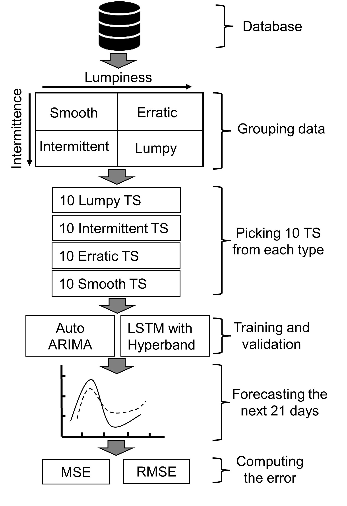

# sc-ts-forecasting-arima-vs-lstm
Supply Chain Forecasting in a fast-moving globaleconomy: Review, Limits and Future Directions




# Time Series Forecasting: LSTM vs ARIMA on Diverse Demand Patterns

This repository contains code to compare **LSTM** and **ARIMA** models across four types of time series demand patterns:

- **Smooth**
- **Intermittent**
- **Erratic**
- **Lumpy**

The analysis is based on the [Favorita Grocery Sales Forecasting dataset](https://www.kaggle.com/competitions/favorita-grocery-sales-forecasting).

> ⚠️ **Note**: All notebooks are intended to be run in **Jupyter Notebook**.

---

## 🧪 Experimental Protocol

The experimental flow includes:
- Dataset preparation and classification into demand types
- Training and evaluation of LSTM vs ARIMA on each group
- Comparative analysis of model performance

📌 Below is the experimental protocol figure:


---

## 📂 Overview

### 📁 `prepare_dataset.ipynb`

This notebook:
- Loads the Favorita dataset
- Preprocesses and categorizes time series into four groups
- Outputs cleaned datasets into:
  - `data/smooth/`
  - `data/intermittent/`
  - `data/erratic/`
  - `data/lumpy/`

### 📁 Model Training and Evaluation

Each notebook trains and compares **ARIMA** and **LSTM** on one group:

- `Smooth TS Group Training Test.ipynb`
- `Intermittent TS Group Training Test.ipynb`
- `Erratic TS Group Training Test.ipynb`
- `Lumpy TS Group Training Test.ipynb`

---

## ⚙️ Environment Setup (via Conda)

```bash
# Create environment
conda create --name ts-forecast-env python=3

# Activate it
conda activate ts-forecast-env

# Install dependencies
conda install -c conda-forge matplotlib
conda install -c anaconda scikit-learn
conda install -c anaconda numpy 
conda install -c anaconda pandas
conda install -c anaconda scipy
conda install -c conda-forge pmdarima
conda install ipykernel

# Register Jupyter kernel
python -m ipykernel install --user --name ts-forecast-env --display-name "Python (ts-forecast-env)"

# Install deep learning libs
pip install tensorflow keras
```
## 📚 Citation

If you use this code, please cite the following paper:

```bibtex
@INPROCEEDINGS{10275183,
  author={Benziane, Bilel Abderrahmane and Lardeux, Benoit and Jridi, Maher and Mcharek, Ayoub},
  booktitle={2023 28th International Conference on Automation and Computing (ICAC)}, 
  title={Supply Chain Forecasting in a Fast-Moving Global Economy: Review, Limits and Future Directions}, 
  year={2023},
  pages={1-6},
  keywords={COVID-19;Recurrent neural networks;Pandemics;Biological system modeling;Data integrity;Supply chains;Time series analysis;Demand forecasting;Demand prediction;Supply chain;Artificial intelligence;Machine learning},
  doi={10.1109/ICAC57885.2023.10275183}
}

